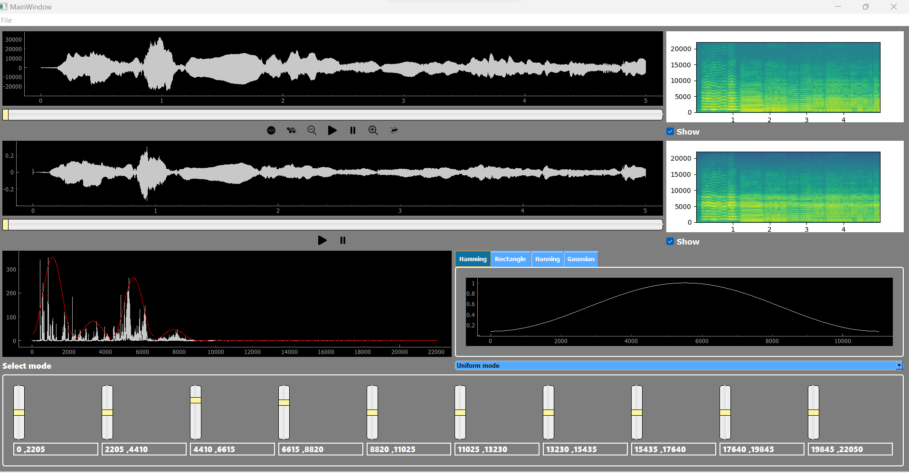
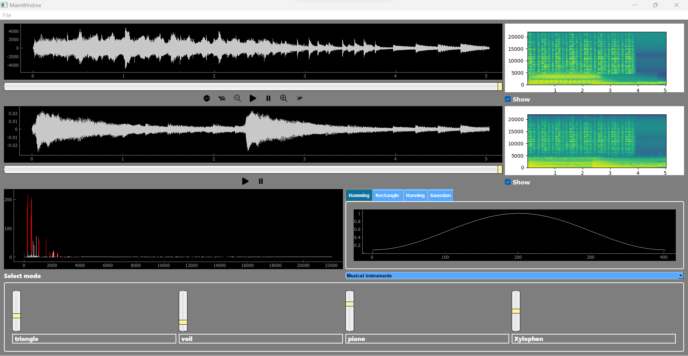
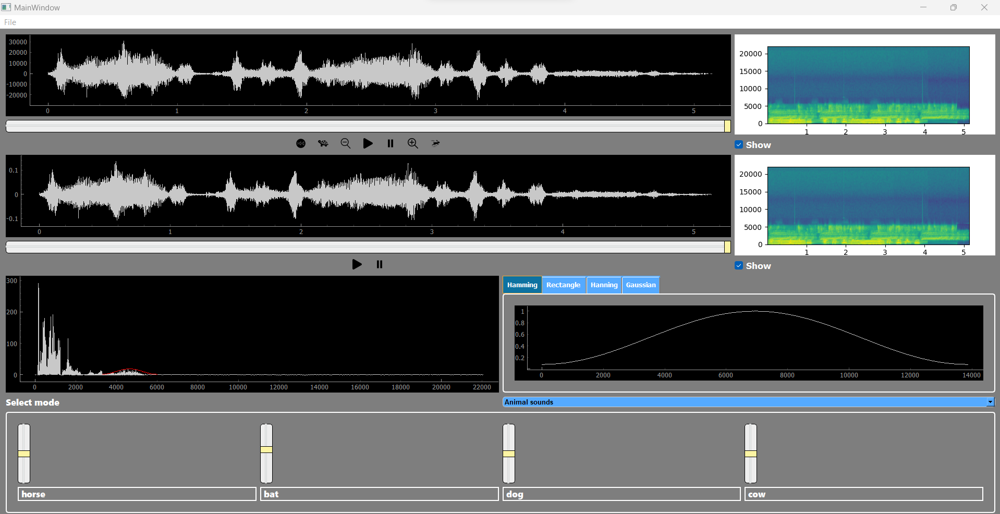
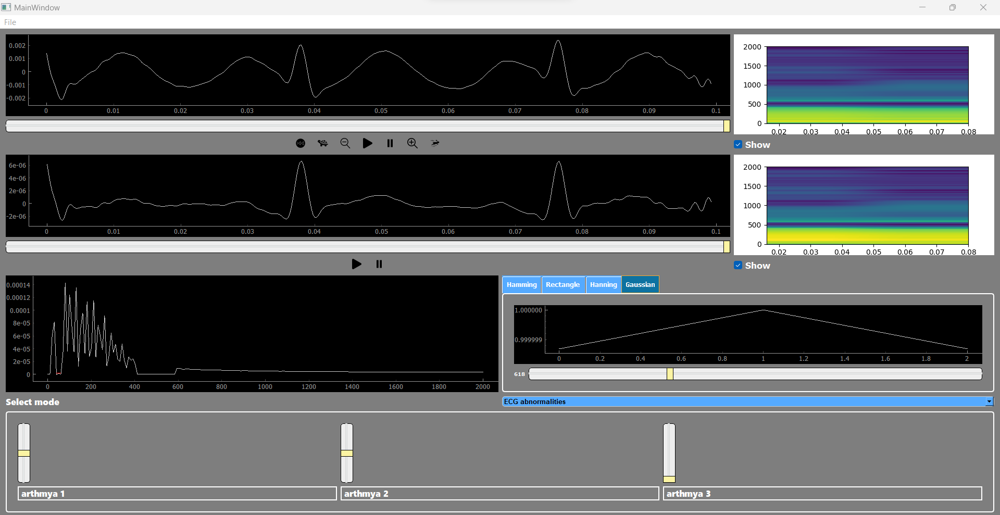
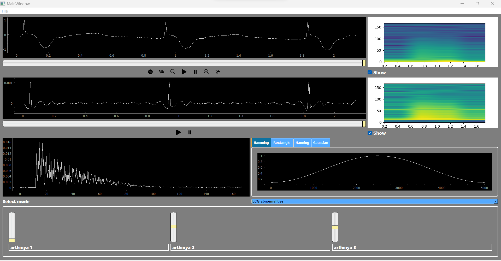

# Signal Equalizer

## Introduction

The Signal Equalizer is a desktop application designed for manipulating signal frequencies to enhance or modify audio content. This tool finds applications in various fields such as music production, speech processing, and biomedical analysis. This README provides an overview of the application's functionalities and usage instructions.

## Description

The Signal Equalizer allows users to open a signal file and adjust the magnitude of specific frequency components using sliders. These adjustments can be made in different modes to cater to various use cases:

1. **Uniform Range Mode**: The signal's frequency range is divided into 10 equal segments, each controlled by a slider on the UI.

  

2. **Musical Instruments Mode**: Sliders correspond to different musical instruments in the input signal, enabling precise adjustment of instrument levels.

  

3. **Animal Sounds Mode**: Similar to the musical instruments mode, sliders control the magnitude of specific animal sounds in the input signal.

  

4. **ECG Abnormalities Mode**: Users can manipulate ECG signals to simulate different arrhythmias by adjusting sliders corresponding to each abnormality type.

  
  

Additionally, the application provides options for applying different multiplication/smoothing windows (Rectangle, Hamming, Hanning, Gaussian) to the adjusted frequencies. Users can customize these windows visually and apply them to the equalizer.

### User Interface Features

- **Mode Selection**: Users can switch between different modes using an option menu or combobox.
- **Sliders**: Sliders allow users to adjust the magnitude of frequency components.
- **Cine Signal Viewers**: Two linked cine signal viewers display the input and output signals synchronously, with full functionality for play, stop, pause, speed control, zoom, pan, and reset.
- **Spectrograms**: Two spectrograms visualize the input and output signals, updating in real-time as adjustments are made. Users can toggle the visibility of spectrograms as needed.
  

